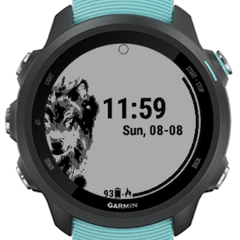

# [GarminWatchFace] LoneWolf
You are not alone in your race
---
You can try at Garmin store via  
https://apps.garmin.com/en-US/apps/2aa0df1d-bb6a-475c-af21-a5992a74db9e
 
---
The DOT on top of the screen shows the lunar phase.

The benzene bar is progress of ACTIVE calories burn daily goal. Default calories target depends on your age, or you can set your goal in the setting.

Under the hood, the watch face is just refresh once per minute to save battery

<table>
    <tr>
        <td></td>
        <td></td>
    </tr>
    <tr>
        <td></td>
        <td></td>
    </tr>
</table>

.... 
Make my color dont like sơn MyColor
